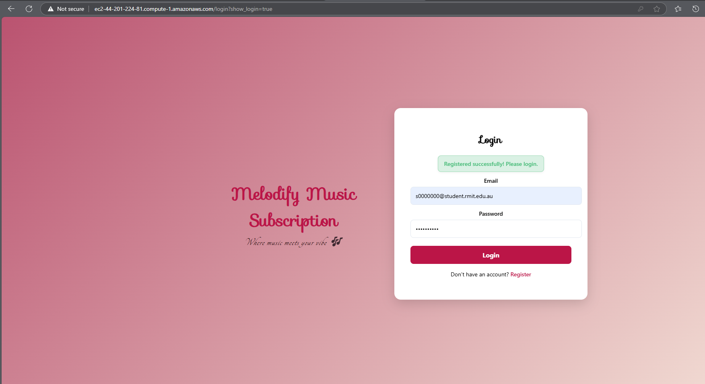
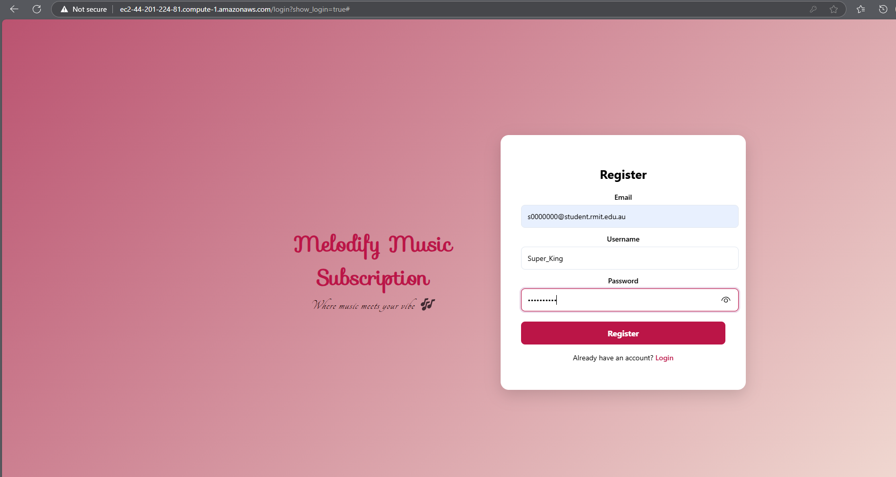
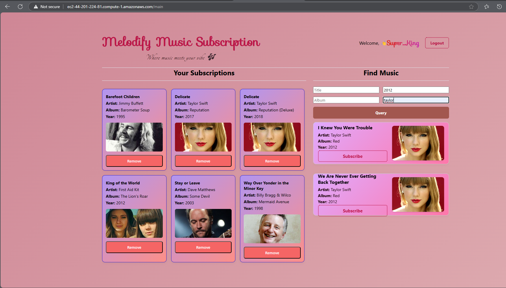
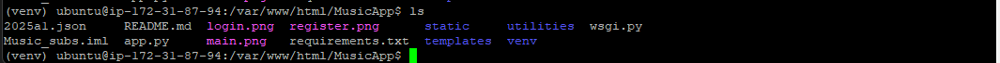
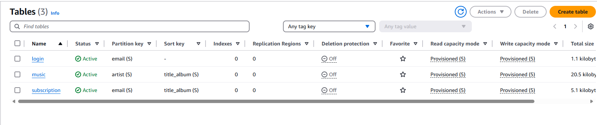
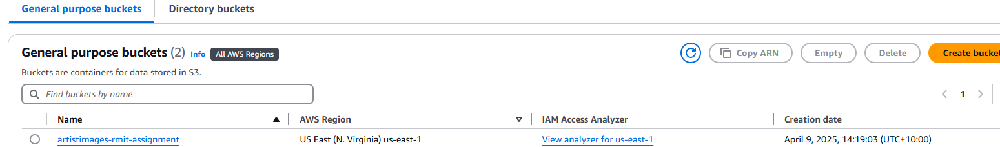

# 🎵 Music Subscription Web Application

A cloud-based music app that allows users to register, log in, search for music, and subscribe to their favorite songs. Built using Flask and AWS services like EC2, S3, DynamoDB, Lambda, and API Gateway.

## 🖼️ User Interface

The application provides the following UI pages:
- `login.html` – Users can log in using registered credentials



- `register.html` – New users can sign up



- `main.html` – Main dashboard to search and subscribe to music
  


---

## 🚀 Tech Stack

| Layer             | Technology                          |
|------------------|-------------------------------------|
| Frontend         | HTML, CSS, JavaScript               |
| Backend          | Python (Flask)                      |
| Cloud Services   | AWS EC2, S3, DynamoDB, Lambda, API Gateway |
| Deployment       | Apache + WSGI on EC2                |
| Package Manager  | pip (Python)                        |

---

## 📦 Features

- 🔐 User Registration and Login
- 🎧 Music Search and Subscription
- ☁️ Artist Image Storage on S3
- 🗃 Data managed via DynamoDB
- ⚙️ Lambda functions exposed via API Gateway
- 🌐 Deployed on EC2 with Apache and WSGI

---

## 🛠️ Local Setup Instructions

1. **Clone the repository**
```bash
git clone https://github.com/Sri-Karthick-S/Music-Subscription/tree/reyaz11
cd Music-Subscription
```

2. **Create and activate virtual environment**
```bash
python3 -m venv venv
source venv/bin/activate  # (Windows: venv\Scripts\activate)
```

3. **Install dependencies**
```bash
pip install -r requirements.txt
```

4. **Set up AWS credentials**
```bash
aws configure
```

5. **Create DynamoDB Tables**
```bash
python utilities/create_login_table.py
python utilities/create_music_table.py
python utilities/create_subscription_table.py
```

6. **Load Music & Images**
```bash
python utilities/load_music_data.py
python utilities/load_artist_images.py
```

7. **Run the Flask App**
```bash
python app.py
```
Open `http://127.0.0.1:5000/` in your browser.

---

## ☁️ Cloud Deployment on EC2 (Apache + WSGI)



### Step 1: Launch EC2 Instance
- Use Ubuntu 20.04 or 22.04
- Configure Inbound Rules:
  - HTTP (80), HTTPS (443), SSH (22 for your IP)

### Step 2: Install Required Packages
```bash
sudo apt update
sudo apt install apache2 libapache2-mod-wsgi-py3 python3-venv git python3-pip -y
```

### Step 3: Clone and Prepare the App
```bash
cd /var/www/html
sudo git clone -b reyaz11 https://github.com/Sri-Karthick-S/Music-Subscription.git
sudo mv Music-Subscription MusicApp
cd MusicApp
python3 -m venv venv
source venv/bin/activate
pip install -r requirements.txt
```

### Step 4: WSGI Setup

Create `wsgi.py`:
```python
import sys
import logging
logging.basicConfig(stream=sys.stderr)
sys.path.insert(0, "/var/www/html/MusicApp")
from app import app as application
```

### Step 5: Apache Config for HTTP
```bash
sudo nano /etc/apache2/sites-available/music.conf
```
Paste the following:
```apache
<VirtualHost *:80>
    ServerName YOUR_PUBLIC_DNS
    WSGIDaemonProcess music python-home=/var/www/html/MusicApp/venv python-path=/var/www/html/MusicApp
    WSGIProcessGroup music
    WSGIScriptAlias / /var/www/html/MusicApp/wsgi.py
    <Directory /var/www/html/MusicApp>
        Require all granted
    </Directory>
</VirtualHost>
```

Enable config:
```bash
sudo a2ensite music.conf
sudo a2dissite 000-default.conf
sudo systemctl reload apache2
```

### Step 6: Enable SSL (Optional)
```bash
sudo a2enmod ssl
sudo systemctl restart apache2
```

---

## 🧾 DynamoDB Tables (Cloud Deployment)

DynamoDB is used to store and manage user, music, and subscription data.



### Table Keys:
- **Login Table**: Partition Key → `email`
- **Music Table**: Partition Key → `title_album`
- **Subscription Table**: Partition Key → `email`, Sort Key → `title_album`

These tables are automatically provisioned when the scripts are executed and are used by Lambda functions for serverless access.

---

## 🖼️ S3 Bucket (Cloud Deployment)

S3 is used to store artist images that appear on the main dashboard.



---

## 🔁 Lambda & API Gateway (Cloud Deployment)

AWS Lambda is used to handle backend logic in a serverless fashion. Each Lambda function is triggered by a corresponding API Gateway endpoint.

### Lambda Functions:
Deployed separately using the AWS Lambda console:
- `loginUserHandler`
- `registerUserHandler`
- `getUserSubscriptionsHandler`
- `searchMusicHandler`
- `subscribeSongHandler`
- `removeSubscriptionHandler`

### API Gateway:
Each Lambda is connected to an HTTP API via API Gateway:
- Allows secure and scalable public API endpoints
- API endpoints can be directly called from the frontend or integrated with your app backend

---

## 🐛 Troubleshooting

- Check Apache logs:
```bash
sudo tail -n 50 /var/log/apache2/error.log
```

- Pull latest code & restart server:
```bash
cd /var/www/html/MusicApp
sudo git pull origin reyaz11
source venv/bin/activate
pip install -r requirements.txt
sudo systemctl reload apache2
```

---